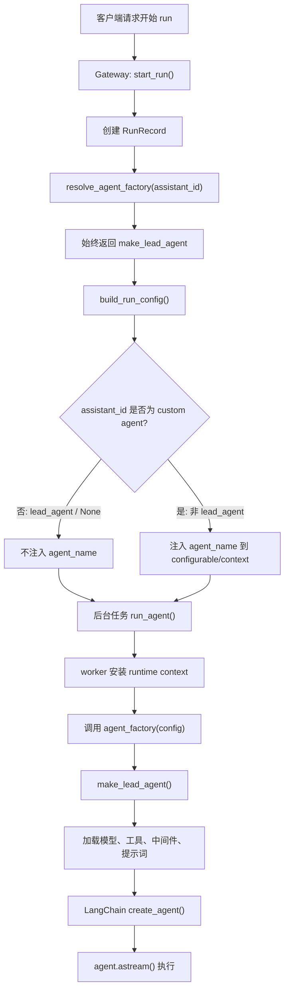
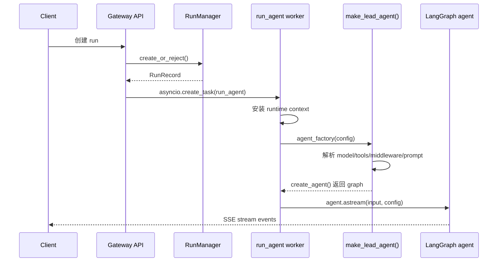
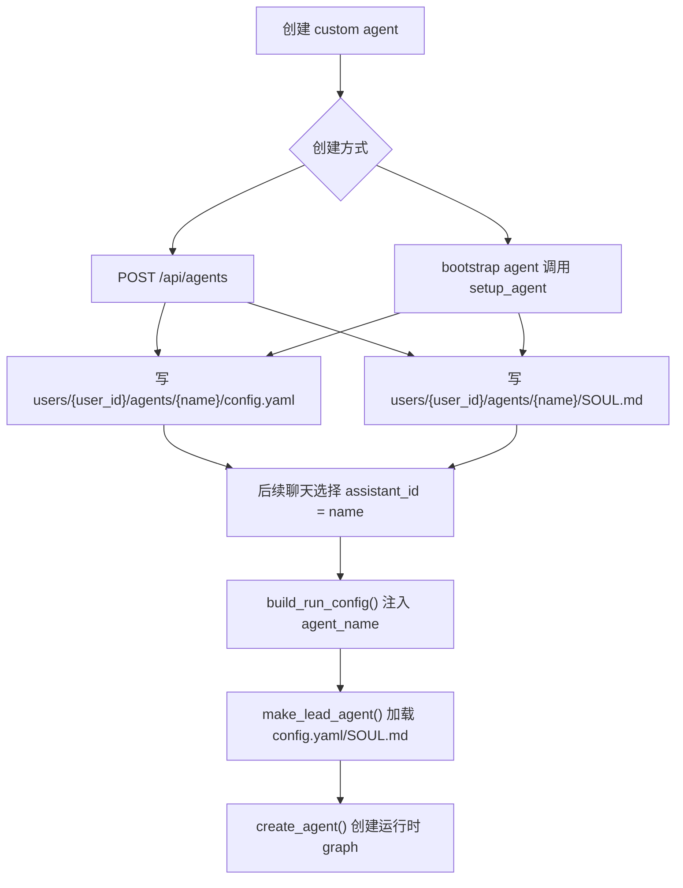
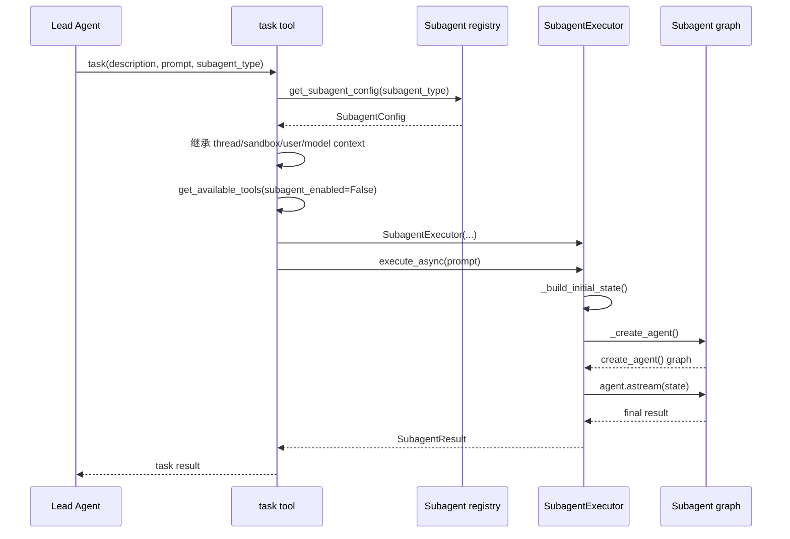

# 后端 Agent 创建机制

本文说明 DeerFlow 后端里 agent 是怎么被创建的，以及它们分别在什么时候被创建。这里的 agent 主要分三类：

- 主运行 agent（lead agent / LangGraph graph）
- 自定义 agent（custom agent）
- 子 agent（subagent）

核心结论：

- `lead_agent` 是每次运行（run）开始时动态创建的运行时图（runtime graph），不是服务启动时常驻创建。
- `custom agent` 创建时只是写入 `config.yaml` 和 `SOUL.md`，真正运行时仍然走 `make_lead_agent()` 动态组装。
- `subagent` 是主 agent 调用 `task(...)` 工具（tool）时临时创建的独立执行图，执行结束后结束。

## 总体入口

LangGraph 配置（LangGraph config）只注册了一个图工厂（graph factory）：

```json
{
  "graphs": {
    "lead_agent": "deerflow.agents:make_lead_agent"
  }
}
```

对应文件：

- `backend/langgraph.json`
- `backend/packages/harness/deerflow/agents/lead_agent/agent.py`

`deerflow.agents:make_lead_agent` 最终来自：

```python
# backend/packages/harness/deerflow/agents/__init__.py
from .lead_agent import make_lead_agent
```

## 总体流程图



## 主运行 Agent

主运行 agent（lead agent）是应用默认聊天使用的 agent。它的创建入口是 `make_lead_agent(config)`。

关键代码：

```python
def make_lead_agent(config: RunnableConfig):
    """LangGraph graph factory; keep the signature compatible with LangGraph Server."""
    runtime_config = _get_runtime_config(config)
    runtime_app_config = runtime_config.get("app_config")
    return _make_lead_agent(config, app_config=runtime_app_config or get_app_config())
```

`_make_lead_agent()` 会读取本次运行的配置：

```python
cfg = _get_runtime_config(config)

thinking_enabled = cfg.get("thinking_enabled", True)
reasoning_effort = cfg.get("reasoning_effort", None)
requested_model_name: str | None = cfg.get("model_name") or cfg.get("model")
is_plan_mode = cfg.get("is_plan_mode", False)
subagent_enabled = cfg.get("subagent_enabled", False)
max_concurrent_subagents = cfg.get("max_concurrent_subagents", 3)
is_bootstrap = cfg.get("is_bootstrap", False)
agent_name = validate_agent_name(cfg.get("agent_name"))
```

如果不是 bootstrap 模式，会按 `agent_name` 加载 custom agent 配置：

```python
agent_config = load_agent_config(agent_name) if not is_bootstrap else None
available_skills = _available_skill_names(agent_config, is_bootstrap)
agent_model_name = agent_config.model if agent_config and agent_config.model else None

model_name = _resolve_model_name(
    requested_model_name or agent_model_name,
    app_config=resolved_app_config,
)
```

最后创建 LangChain agent：

```python
return create_agent(
    model=create_chat_model(
        name=model_name,
        thinking_enabled=thinking_enabled,
        reasoning_effort=reasoning_effort,
        app_config=resolved_app_config,
        attach_tracing=False,
    ),
    tools=final_tools,
    middleware=build_middlewares(
        config,
        model_name=model_name,
        agent_name=agent_name,
        available_skills=available_skills,
        app_config=resolved_app_config,
        deferred_setup=setup,
    ),
    system_prompt=apply_prompt_template(
        subagent_enabled=subagent_enabled,
        max_concurrent_subagents=max_concurrent_subagents,
        agent_name=agent_name,
        available_skills=available_skills,
        app_config=resolved_app_config,
        deferred_names=setup.deferred_names,
    ),
    state_schema=ThreadState,
)
```

### 什么时候创建主运行 Agent

主运行 agent 在每次 run 的后台 worker 中创建。

Gateway 入口：

```python
agent_factory = resolve_agent_factory(body.assistant_id)
graph_input = normalize_input(body.input)
config = build_run_config(
    thread_id,
    body.config,
    body.metadata,
    assistant_id=body.assistant_id,
)

task = asyncio.create_task(
    run_agent(
        bridge,
        run_mgr,
        record,
        ctx=run_ctx,
        agent_factory=agent_factory,
        graph_input=graph_input,
        config=config,
        stream_modes=stream_modes,
        stream_subgraphs=body.stream_subgraphs,
        interrupt_before=body.interrupt_before,
        interrupt_after=body.interrupt_after,
    )
)
```

worker 里真正调用 factory：

```python
runnable_config = RunnableConfig(**config)

if ctx.app_config is not None and _agent_factory_supports_app_config(agent_factory):
    agent = agent_factory(config=runnable_config, app_config=ctx.app_config)
else:
    agent = agent_factory(config=runnable_config)
```

随后开始执行：

```python
async for chunk in agent.astream(
    graph_input,
    config=runnable_config,
    stream_mode=single_mode,
):
    ...
```

因此，主运行 agent 的生命周期是：



## Custom Agent

自定义 agent（custom agent）不是独立的 Python 类，也不是服务启动时注册成另一个 graph。它在磁盘上表现为一组文件：

- `config.yaml`
- `SOUL.md`

### HTTP 创建路径

HTTP API 创建入口：

```python
@router.post(
    "/agents",
    response_model=AgentResponse,
    status_code=201,
)
async def create_agent_endpoint(request: AgentCreateRequest) -> AgentResponse:
    ...
```

创建时写入目录和文件：

```python
agent_dir = paths.user_agent_dir(user_id, normalized_name)
legacy_dir = paths.agent_dir(normalized_name)

if legacy_dir.exists():
    return None

agent_dir.mkdir(parents=True, exist_ok=False)

config_data: dict = {"name": normalized_name}
if request.description:
    config_data["description"] = request.description
if request.model is not None:
    config_data["model"] = request.model
if request.tool_groups is not None:
    config_data["tool_groups"] = request.tool_groups
if request.skills is not None:
    config_data["skills"] = request.skills

config_file = agent_dir / "config.yaml"
with open(config_file, "w", encoding="utf-8") as f:
    yaml.dump(config_data, f, default_flow_style=False, allow_unicode=True)

soul_file = agent_dir / "SOUL.md"
soul_file.write_text(request.soul, encoding="utf-8")
```

### Bootstrap 创建路径

bootstrap 模式下，`make_lead_agent()` 会暴露 `setup_agent` 工具：

```python
if is_bootstrap:
    raw_tools = (
        get_available_tools(
            model_name=model_name,
            subagent_enabled=subagent_enabled,
            app_config=resolved_app_config,
        )
        + [setup_agent]
    )
    ...
    return create_agent(...)
```

`setup_agent` 工具被模型调用后写文件：

```python
@tool(parse_docstring=True)
def setup_agent(
    soul: str,
    description: str,
    runtime: Runtime,
    skills: list[str] | None = None,
) -> Command:
    ...
```

```python
agent_name: str | None = runtime.context.get("agent_name") if runtime.context else None
agent_name = validate_agent_name(agent_name)

if agent_name:
    user_id = resolve_runtime_user_id(runtime)
    agent_dir = paths.user_agent_dir(user_id, agent_name)
else:
    agent_dir = paths.base_dir

agent_dir.mkdir(parents=True, exist_ok=True)

if agent_name:
    config_data: dict = {"name": agent_name}
    if description:
        config_data["description"] = description
    if skills is not None:
        config_data["skills"] = skills

    config_file = agent_dir / "config.yaml"
    with open(config_file, "w", encoding="utf-8") as f:
        yaml.dump(config_data, f, default_flow_style=False, allow_unicode=True)

soul_file = agent_dir / "SOUL.md"
soul_file.write_text(soul, encoding="utf-8")
```

### Custom Agent 使用时如何路由

所有 `assistant_id` 都会映射到同一个 factory：

```python
def resolve_agent_factory(assistant_id: str | None):
    """Resolve the agent factory callable from config."""
    from deerflow.agents.lead_agent.agent import make_lead_agent

    return make_lead_agent
```

当 `assistant_id` 不是默认 `lead_agent` 时，后端把它转成 `agent_name`：

```python
if assistant_id and assistant_id != _DEFAULT_ASSISTANT_ID:
    normalized = assistant_id.strip().lower().replace("_", "-")
    ...
    effective_agent_name = explicit_agent_name or normalized

    if isinstance(configurable, dict):
        configurable["agent_name"] = effective_agent_name
    if isinstance(runtime_context, dict):
        runtime_context["agent_name"] = effective_agent_name
```

然后 `make_lead_agent()` 读取 `agent_name`：

```python
agent_name = validate_agent_name(cfg.get("agent_name"))
agent_config = load_agent_config(agent_name) if not is_bootstrap else None
```

custom agent 的生命周期：



## Subagent

子 agent（subagent）由主 agent 在运行过程中通过 `task` 工具创建。它适合把复杂任务、并行调研、长输出探索隔离到独立上下文。

`task` 工具入口：

```python
@tool("task", parse_docstring=True)
async def task_tool(
    runtime: Runtime,
    description: str,
    prompt: str,
    subagent_type: str,
    tool_call_id: Annotated[str, InjectedToolCallId],
) -> str:
    ...
```

先根据 `subagent_type` 找配置：

```python
available_subagent_names = get_available_subagent_names(app_config=runtime_app_config)

config = get_subagent_config(subagent_type, app_config=runtime_app_config)
if config is None:
    available = ", ".join(available_subagent_names)
    return f"Error: Unknown subagent type '{subagent_type}'. Available: {available}"
```

再继承父 agent 的运行上下文：

```python
if runtime is not None:
    sandbox_state = runtime.state.get("sandbox")
    thread_data = runtime.state.get("thread_data")
    thread_id = runtime.context.get("thread_id") if runtime.context else None
    metadata = runtime.config.get("metadata", {})
    parent_model = metadata.get("model_name")
    trace_id = metadata.get("trace_id") or str(uuid.uuid4())[:8]

user_id = resolve_runtime_user_id(runtime)
parent_context = runtime.context if runtime is not None else None
parent_context = parent_context if isinstance(parent_context, dict) else {}
```

子 agent 会获取工具，但明确关闭嵌套 subagent：

```python
available_tools_kwargs = {
    "model_name": effective_model,
    "groups": parent_tool_groups,
    "subagent_enabled": False,
}
tools = get_available_tools(**available_tools_kwargs)
```

然后创建 `SubagentExecutor` 并开始后台执行：

```python
executor = SubagentExecutor(**executor_kwargs)

# Start background execution (always async to prevent blocking)
task_id = executor.execute_async(prompt, task_id=tool_call_id)
```

`SubagentExecutor` 内部真正创建子 agent 图：

```python
def _create_agent(
    self,
    tools: list[BaseTool] | None = None,
    *,
    deferred_setup: "DeferredToolSetup | None" = None,
):
    app_config = self.app_config or get_app_config()
    if self.model_name is None:
        self.model_name = resolve_subagent_model_name(
            self.config,
            self.parent_model,
            app_config=app_config,
        )

    model = create_chat_model(
        name=self.model_name,
        thinking_enabled=False,
        app_config=app_config,
        attach_tracing=False,
    )

    middlewares = build_subagent_runtime_middlewares(
        app_config=app_config,
        model_name=self.model_name,
        lazy_init=True,
        deferred_setup=deferred_setup,
    )

    return create_agent(
        model=model,
        tools=tools if tools is not None else self.tools,
        middleware=middlewares,
        system_prompt=None,
        state_schema=ThreadState,
        checkpointer=False,
    )
```

执行时机在 `_aexecute()`：

```python
state, final_tools, deferred_setup = await self._build_initial_state(task)
agent = self._create_agent(final_tools, deferred_setup=deferred_setup)
```

子 agent 时序图：



## 三类 Agent 对比

| 类型 | 创建入口 | 什么时候创建 | 是否落盘 | 运行时创建方式 |
|---|---|---|---|---|
| 主运行 agent（lead agent） | `make_lead_agent()` | 每次 run 执行时 | 不落盘 | `create_agent(...)` |
| 自定义 agent（custom agent） | `POST /api/agents` 或 `setup_agent` | 创建时写配置；使用时创建运行图 | `config.yaml`、`SOUL.md` | 仍走 `make_lead_agent()` |
| 子 agent（subagent） | `task(...)` 工具 | 主 agent 调用 `task` 时 | 不作为 custom agent 落盘 | `SubagentExecutor._create_agent()` |

## 关键路径索引

- `backend/langgraph.json`：注册 `lead_agent` 图工厂。
- `backend/app/gateway/services.py`：run 生命周期，包含 `start_run()`、`build_run_config()`、`resolve_agent_factory()`。
- `backend/packages/harness/deerflow/runtime/runs/worker.py`：后台 worker 真正调用 `agent_factory(config)` 并执行 `agent.astream()`。
- `backend/packages/harness/deerflow/agents/lead_agent/agent.py`：`make_lead_agent()` 和 `_make_lead_agent()`，主 agent 的核心工厂。
- `backend/app/gateway/routers/agents.py`：HTTP custom agent CRUD。
- `backend/packages/harness/deerflow/tools/builtins/setup_agent_tool.py`：bootstrap 流程里创建 custom agent 的工具。
- `backend/packages/harness/deerflow/tools/builtins/task_tool.py`：主 agent 委派 subagent 的工具。
- `backend/packages/harness/deerflow/subagents/executor.py`：subagent 运行时图创建和执行。
- `backend/packages/harness/deerflow/agents/factory.py`：SDK 级 `create_deerflow_agent()` 工厂，不是 Gateway 默认 run 链路主入口。
